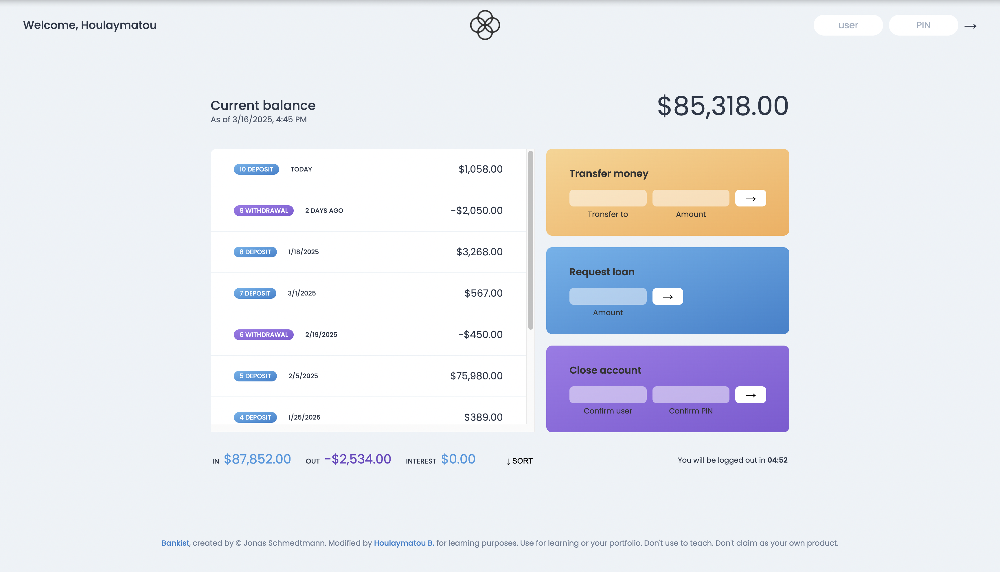

# Bankist App 🏦

## Overview 👀

Bankist is a minimalist banking application that simulates basic online banking features. This project was developed as part of my JavaScript course to demonstrate practical applications of array methods, DOM manipulation, and modern JavaScript features.

## Features ✨

- **User Authentication**: Log in with username and PIN
- **Transaction History**: View all account movements with dates
- **Transfer Money**: Send money to other bankist users
- **Request Loan**: Request a loan if you meet the requirements
- **Close Account**: Delete your account
- **Auto Logout**: Timer-based session management for security
- **Sorting**: Sort transactions by amount
- **Formatted Numbers**: Locale-specific currency and date formatting

## Responsive Design 📲

The application is responsive and works on:

- Desktop
- Tablets
- Mobile phones

## Technologies Used 👩🏽‍💻

- HTML5
- CSS3 with CSS Variables for theming
- Vanilla JavaScript
- Internationalization API for formatting dates and currencies

## Array Methods Demonstrated 📝

The project showcases various JavaScript array methods including:

- `map()`: For creating usernames and transforming data
- `filter()`: For calculating deposits and withdrawals
- `reduce()`: For summing up balances and statistics
- `find()`: For locating specific accounts
- `findIndex()`: For account deletion
- `some()`: For loan approval logic
- `every()`: For validation checks
- `flat()` & `flatMap()`: For data manipulation
- `sort()`: For transaction sorting

## Learning Objectives 📚

This project helped solidify understanding of:

- Array methods and their practical applications
- Working with dates in JavaScript
- Number formatting with Internationalization API
- DOM manipulation for dynamic UI updates
- Event handling and user interaction
- Timer functions for session management
- Data transformation and manipulation

## Usage 🛜

### Live Demo 🌐

Check out the live demo: [Bankist App](https://bankist-hb.netlify.app/)

### Local Installation 💻

1. Clone the repository
2. Open `index.html` in your browser

### Login Credentials 🔐

Log in with one of the following accounts:

- Username: `js`, PIN: `1111` (Jonas Schmedtmann)
- Username: `jd`, PIN: `2222` (Jessica Davis)
- Username: `hb`, PIN: `2025` (Houlaymatou B.)

## Course Information 👩🏽‍🏫

- Instructor: Jonas Schmedtmann
- Course: The Complete Javascript Course: From Zero to Expert
- Where: On Udemy
- My Rating: 🌟🌟🌟🌟🌟 (so far)

## Credits 💵

- Original concept and design: Jonas Schmedtmann
- Modified by: Houlaymatou B.
- For educational purposes only

## License ‼️

This project is for learning purposes. Use it for your portfolio or further learning, but do not claim it as your own product or use it for teaching purposes.

---

🚨 _Note: This is a front-end only application with no backend. All data is stored in memory and will reset on page refresh._
